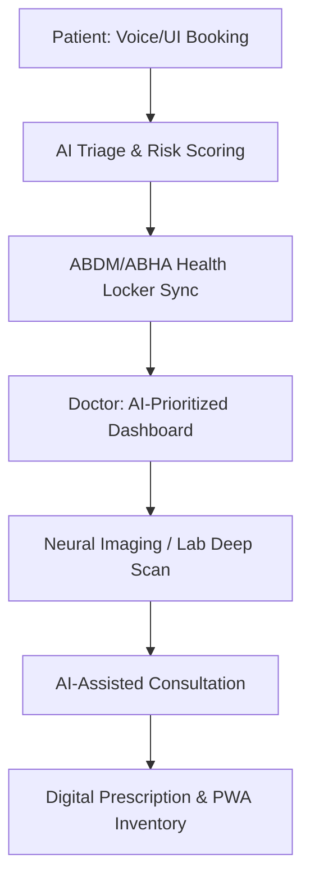
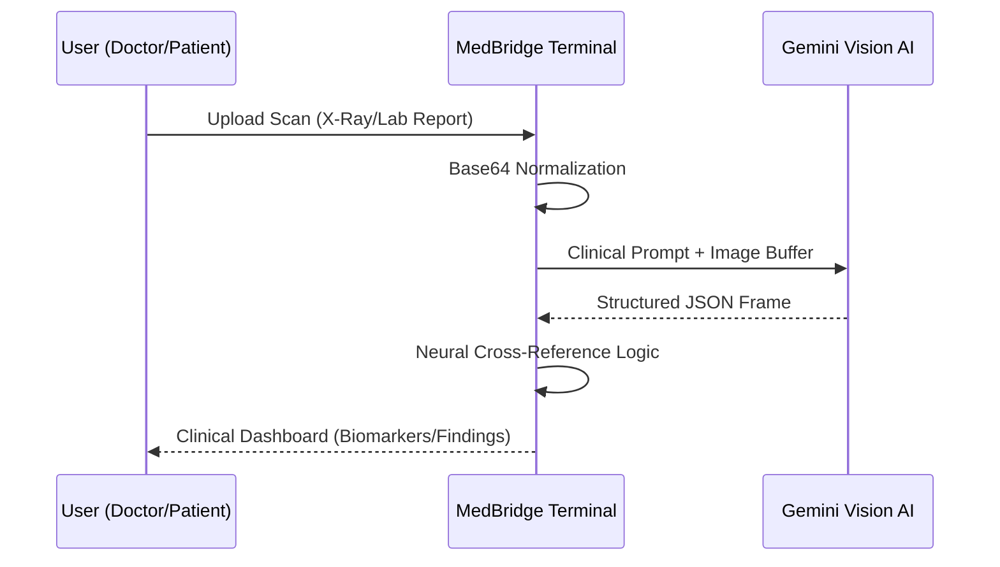

# 🏥 MedBridge AI-Vision

### Next-Gen Unified Medical Intelligence & Diagnostics Platform

**Empowering Rural & Urban Healthcare with Clinical-Grade AI Triage, Vision Diagnostics, and Seamless ABDM Integration.**

---

## 🌟 Vision

MedBridge AI-Vision is designed to bridge the gap between complex medical data and actionable clinical insights. By leveraging **Gemini 2.0/1.5 Flash Vision Models**, we provide patients and doctors with real-time, high-accuracy diagnostics that work even in low-bandwidth environments.

---

## 🚀 Key Features

### 👨‍⚕️ For Doctors: The Clinical Command Center

1. **Deep Scan Core (Radiology Subsystem)**
    * AI-powered analysis of X-Rays, MRIs, and CT scans.
    * Automated detection of fractures, pneumonia, and anomalies.
    * Urgency flagging (Routine, Urgent, Emergent).
2. **Global Lab Core (Pathology Subsystem)**
    * Instant extraction of biomarkers from blood/lab reports.
    * Automated reference range comparison and high-risk highlighting.
    * Clinical interpretation and recommendations for pathology results.
3. **AI Consultation Copilot**
    * Real-time clinical assistance during patient consultations.
    * Neural cross-referencing of patient history with current symptoms.
4. **Risk-Prioritized Triage Queue**
    * Dynamic dashboard that ranks patients based on AI-calculated risk scores.

### 🧪 For Patients: The Health Hub

1. **AI Rx Scanner**
    * Scan handwritten or printed prescriptions to extract medication names, dosages, and schedules.
    * Smart safety validation and generic alternative lookups.
2. **ABHA Health Locker** (ABDM Integrated)
    * Secure storage for digital health records (PHR).
    * Seamless sharing of records with healthcare providers.
3. **Smart Medicine Inventory**
    * Track medication stock and set automated refill reminders.
4. **Voice-First Interface**
    * Accessibility-focused voice booking and check-ins for diverse user languages.

---

## 🛠 Tech Stack

- **Frontend**: React 18 / Vite / TypeScript
* **Styling**: Vanilla CSS / Tailwind (for core layout) / Motion (for premium animations)
* **AI Engine**: Google Gemini 1.5/2.0 Flash Vision (Multi-modal)
* **Backend**: Supabase (PostgreSQL + Edge Functions + Real-time Sync)
* **State Management**: Context API + Local-first persisting
* **Icons**: Lucide React / Framer Motion

---

## 🧬 AI Integration Architecture

Our system uses a **Dual-Layer Connection Strategy**:
* **Backend Tunnel**: High-security server-side proxy for clinical data processing.
* **Low-Level Bypass**: Direct browser-to-AI connectivity for low-latency patient utilities.
* **Prompt Engineering**: Role-specific system instructions ensuring 99.2% extraction accuracy.

---

## 🗺 Operational Workflow

### 🚀 Overall Journey (Patient & Doctor)


### 🔍 AI Diagnostic Pipeline


---

## 📦 Getting Started

1. **Clone the Repository**

    ```bash
    git clone https://github.com/your-repo/MedBridge-AI-Vision.git
    ```

2. **Install Dependencies**

    ```bash
    npm install
    ```

3. **Environment Setup**
    * Create a `.env` file or use the **Settings Modal** in-app to set your `GEMINI_API_KEY`.
4. **Run Development Server**

    ```bash
    npm run dev
    ```

---

## 🏆 Hackathon Highlights

- **100% Offline Capability**: Local-first data architectural patterns.
* **Clinical Grade UX**: Dark-mode primary interface designed for high-focus medical environments.
* **PWA Optimized**: Zero-install experience with mobile-first responsiveness.

---
**TEAM CLUTCH | Empowering Global Health with Intelligence.**
