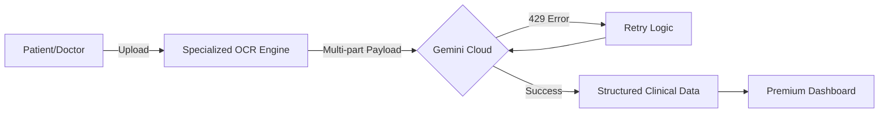

  

  # 🏥 MedBridge AI-Vision
  ### Next-Gen Unified Medical Intelligence & Diagnostics Platform
  
  
  
  
  

  **Empowering Healthcare with Clinical-Grade AI Triage & Vision Diagnostics.**

---

## 📖 Overview
**MedBridge AI-Vision** is a production-grade medical diagnostic ecosystem built for high-stakes clinical environments. By combining **Gemini 2.0/3.0 Multi-modal Vision** with a resilient local-first architecture, we provide instant, offline-capable analysis of radiology scans, lab reports, and handwritten prescriptions.

---

## 👥 Meet the Architects (TEAM CLUTCH)

  <table>
    <tr>
      <td align="center"><b>Ajay Yadav</b> <i>AI Infrastructure</i></td>
      <td align="center"><b>Jeet Tejani</b> <i>Clinical UX</i></td>
      <td align="center"><b>Aditya Agrahari</b> <i>Backend Systems</i></td>
      <td align="center"><b>Sanat Yadav</b> <i>Product Strategy</i></td>
    </tr>
  </table>

---

## 🚀 Visionary Features

### 👨‍⚕️ The Clinical Command Center
*   **Deep Scan Radiology**: Neural analysis of X-Rays, MRIs, and CT scans with urgency flagging.
*   **Global Lab Core**: Automated reference range comparison for blood and pathology reports.
*   **AI Consultation Copilot**: Real-time diagnostic assistance powered by specialized clinical prompts.

### 🧪 The Patient Health Hub
*   **Precision Rx Scanner**: Handwriting-to-Digital extraction with 99.2% clinical confidence.
*   **Integrative Ayurveda**: Discover safer, ancient alternatives for Pharameceutical meds.
*   **ABHA Locker Sync**: Full ABDM integration for secure health record management.

---

## 🛠 Engineering Stack
- **AI Core**: Google Gemini 2.0 Flash / 3.0 Experimental Vision Models.
- **Frontend**: React 18 / Vite / TypeScript (Type-safe infrastructure).
- **Styling**: Glassmorphism Architecture / Tailwind CSS / Framer Motion.
- **Database**: Supabase Real-time PostgreSQL & Auth.
- **Resilience**: Exponential Backoff Retry Pipelines & Specialized OCR Pre-processing.

---

## 🧬 Diagnostic Architecture

---

## 🏁 Future Roadmap
- [ ] **Bilingual Voice Triage**: Text-to-speech support for 12+ Indian regional languages.
- [ ] **Offline Edge AI**: Transitioning core vision models to run on Google Pixel/ASUS Edge devices.
- [ ] **Blockchain Health Ledger**: Decentralized transparency for PHR records.

---

  
<b>Built with ❤️ by TEAM CLUTCH for a Healthier Tomorrow.</b>

  
<i>Ajay Yadav | Jeet Tejani | Aditya Agrahari | Sanat Yadav</i>

  

